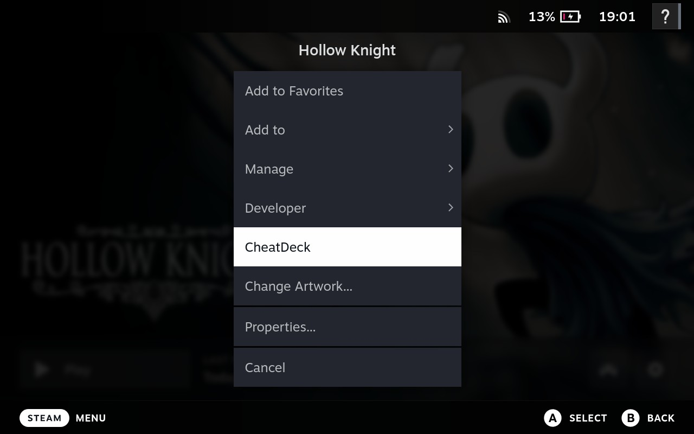
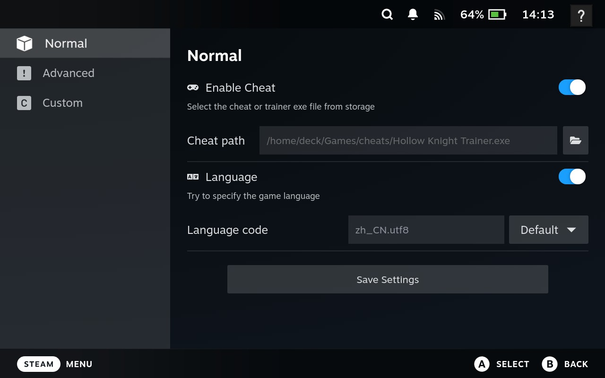
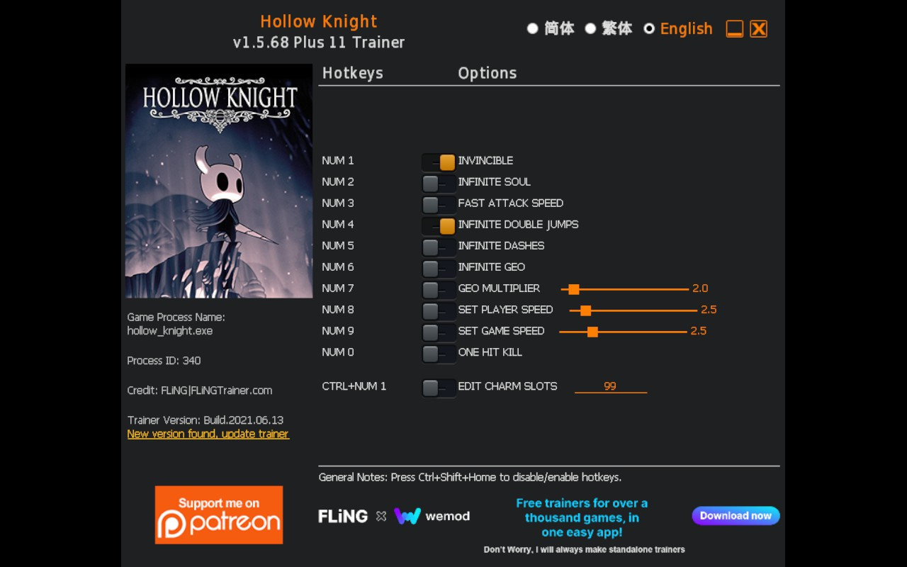

# CheatDeck

CheatDeck is a [Decky Loader](https://github.com/SteamDeckHomebrew/decky-loader) plugin to make it more conveniently to use cheat or trainer and manage launch options on your Steam Deck.

## Nightly Release Download
You can download the latest nightly build of CheatDeck from the [following link](https://nightly.link/SheffeyG/CheatDeck/workflows/dev-build/main/CheatDeck.zip) and installing as ZIP in Decky Loader, or by directly installing from URL using `https://nightly.link/SheffeyG/CheatDeck/workflows/dev-build/main/CheatDeck.zip` in Decky Loader.

## How To Use
1. Download any cheat or trainer from a trusted channel to your Steam Deck.
2. Access the game context menu to find the `CheatDeck` menu item.
    
 
screenshot
  

3. Enable the cheat setting and select the cheat EXE file, and save settings.
    
 
screenshot
  

4. After launching the game, the cheat window should appear automatically.
If it doesn't, press the Steam key to toggle between the game and cheat interfaces.
    
 
screenshot
  

## Note
- Ensure Developer Mode is enabled in your Steam settings.
- The file or folder name should not contain any slashes or quotes.
- If you cannot activate the selected cheat, switch to windowed mode in the game settings.
- If the program or trainer is not launching, it may be due to requiring [.NET Core](https://dotnet.microsoft.com/en-us/download/dotnet), [.NET Framework](https://dotnet.microsoft.com/en-us/download/dotnet-framework) or [Visual Studio Redistributable](https://learn.microsoft.com/en-us/cpp/windows/latest-supported-vc-redist) that is not available in your compatibility environment. Use `protontricks` to install the required dependency.

## Advanced Options
- `LANGUAGE`: Adjust the language environment settings if your game or cheat displays incorrect language (common in non-Steam games).
- `DXVK_ASYNC`: Enable shader pre-caching for games using ProtonGE versions earlier than 7-45.
- `RADV_PERFTEST`: Enable shader pre-caching for games using ProtonGE versions above 7-45.
- `STEAM_COMPAT_DATA_PATH`: Specify a folder as the shared prefix for the game, so you don't have to upgrade dependencies repeatedly (May need to migrate game saves).

## Custom Options
There are 3 kinds of launch options for most games, so you can add and quickly access them for any game.
|Type                |Format                    |Note                      |
|--------------------|--------------------------|--------------------------|
|Environment Variable|`key=value` `key="with space"` |Quote the value if it has a space.   |
|Prefix Commands     |`~/my_script run`   |Support multiple commands.|
|Flag & Arguments    |`--flag` `--key value` `--args=val`|The second field could be empty. Arguments like `--args=val` should be placed in the first field while keeping the second field empty.|

## Acknowledge
- [decky-steamgriddb](https://github.com/SteamGridDB/decky-steamgriddb)
- [decky-autosuspend](https://github.com/jurassicplayer/decky-autosuspend)
- [SDH-CssLoader](https://github.com/DeckThemes/SDH-CssLoader)
