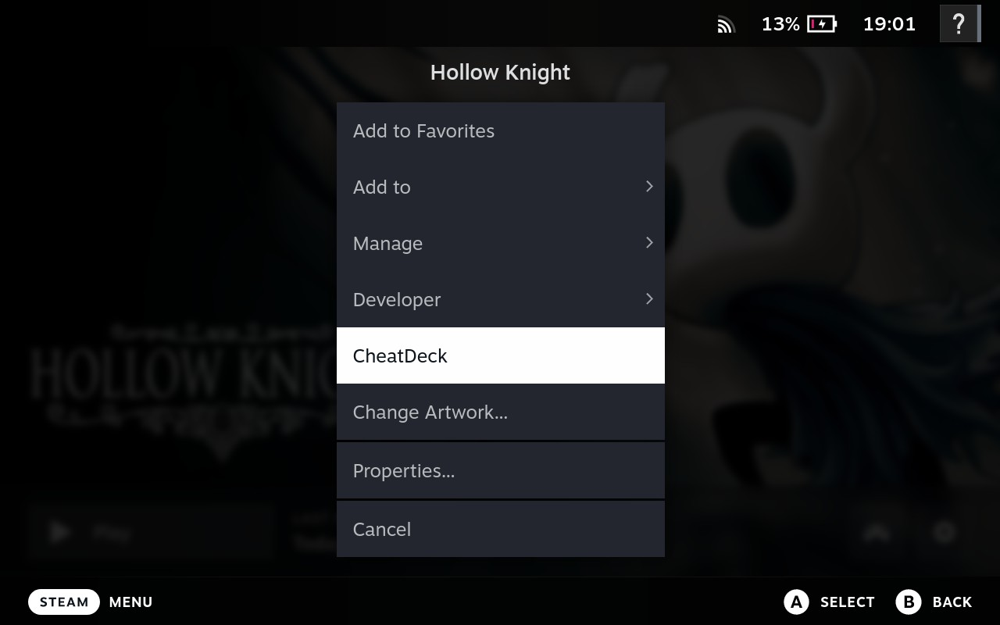
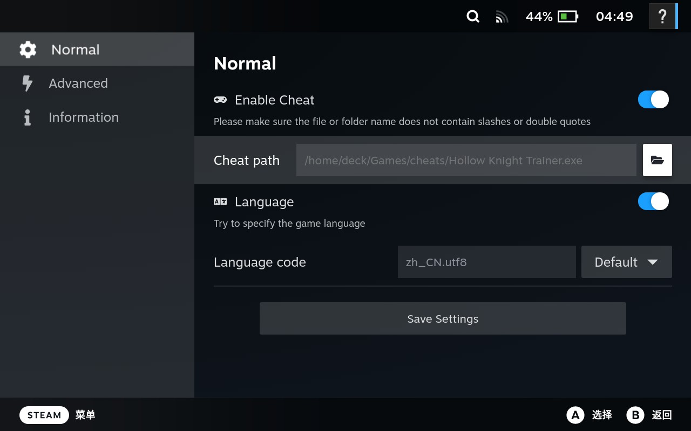

# CheatDeck
CheatDeck is a [Decky Loader](https://github.com/SteamDeckHomebrew/PluginLoader) plugin to make it more conveniently to use cheat or trainer, also provide some other launch options like language for games in game mode.

## How to use
1. Enable the developer mode at steam system settings.
2. Download the cheat or trainer you need in your steamdeck.
3. Navigate to the game details menu, and find the `CheatDeck` item.

4. Enable the cheat setting and select the cheat exe file you just downloaded, then save settings.

5. Launch the game, and the cheat windows should be shown, if not, press the `steam` key, you can switch the game and cheat windows.

## Tips
- Please make sure the file or folder name does not contain slashes or quotes.
- If you are unable to click on the selected cheat, please switch to windowed mode in the game settings.
- Use the language code setting if your game or cheat language not correct (most on non-steam games).

## Reference
- [decky-loader](https://github.com/SteamDeckHomebrew/decky-loader)  
- [decky-steamgriddb](https://github.com/SteamGridDB/decky-steamgriddb)  
- [decky-autosuspend](https://github.com/jurassicplayer/decky-autosuspend)
