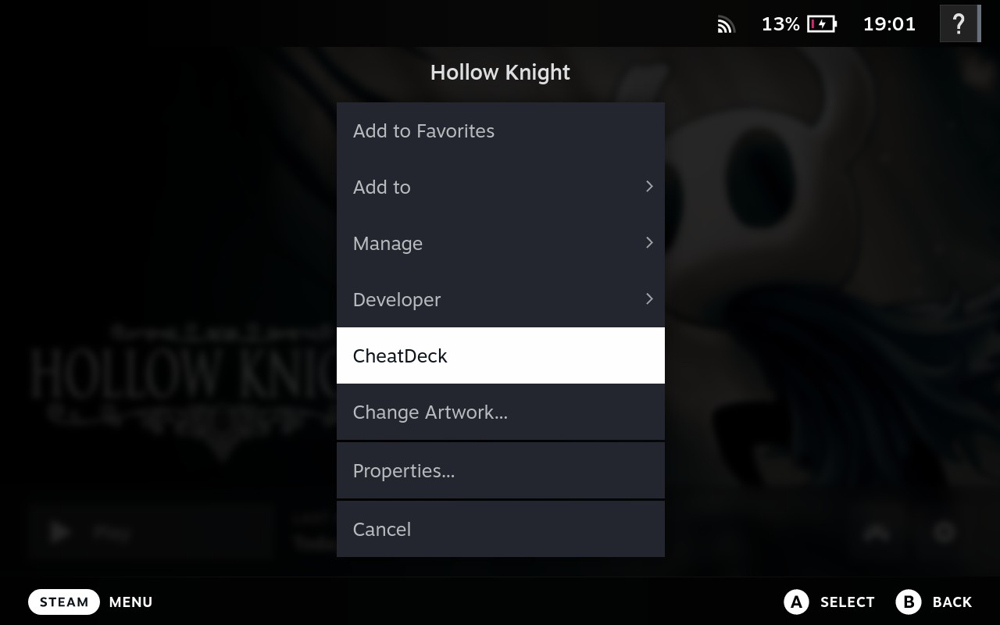
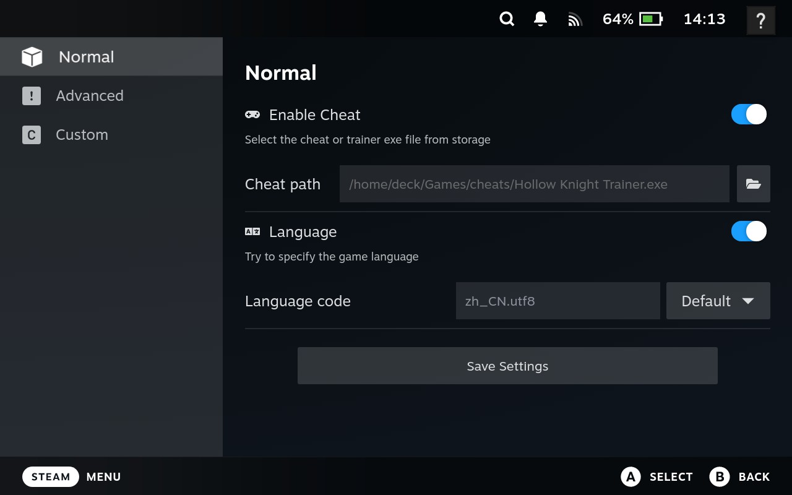
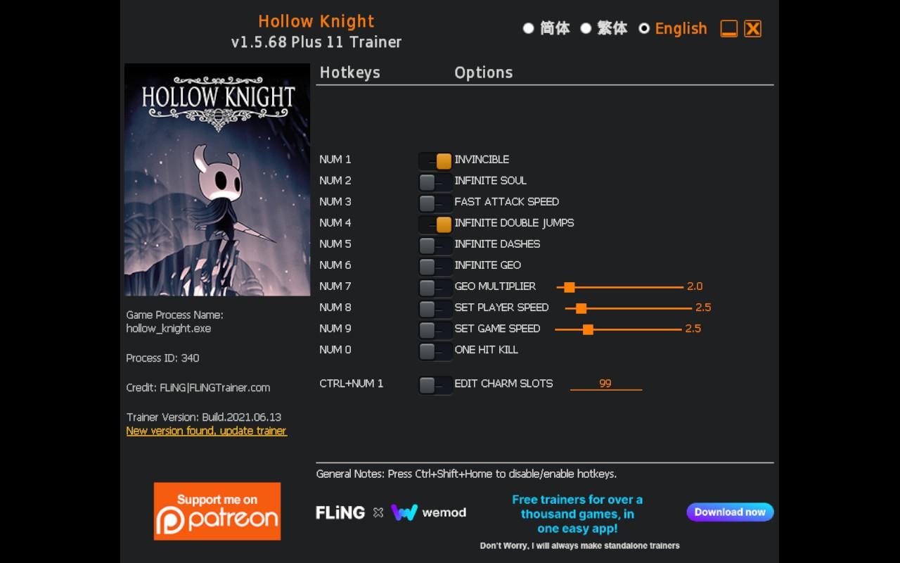

# CheatDeck

[](https://nightly.link/SheffeyG/CheatDeck/workflows/dev-build/main/CheatDeck.zip)


[](./LICENSE)

CheatDeck is a [Decky Loader](https://github.com/SteamDeckHomebrew/decky-loader) plugin to make it more conveniently to use cheat or trainer and manage launch options on your Steam Deck.

> You can download the latest nightly build of CheatDeck from the [following link](https://nightly.link/SheffeyG/CheatDeck/workflows/dev-build/main/CheatDeck.zip) and installing as ZIP in Decky Loader, or by directly installing from URL using `https://nightly.link/SheffeyG/CheatDeck/workflows/dev-build/main/CheatDeck.zip` in Decky Loader.

## Basic Usage

1. Download any cheat or trainer from a trusted channel to your Steam Deck.
2. Access the game context menu to find the `CheatDeck` menu item.
   <details open> <summary>screenshot</summary>  </details>
3. Enable the cheat setting and select the cheat EXE file, then save settings.
   <details open> <summary>screenshot</summary>  </details>
4. After launching the game, the cheat window should appear automatically.
If it doesn't, press the Steam key to toggle between the game and cheat interfaces.
    <details open> <summary>screenshot</summary>  </details>

### Troubleshooting

- Ensure Developer Mode is enabled in your Steam settings.
- File or folder names must not contain slashes or quotes.
- If you cannot activate the selected cheat, switch the game to windowed mode.
- If a program or trainer does not launch, it may require [.NET Core](https://dotnet.microsoft.com/en-us/download/dotnet), [.NET Framework](https://dotnet.microsoft.com/en-us/download/dotnet-framework), or the [Visual C++ Redistributable](https://learn.microsoft.com/en-us/cpp/windows/latest-supported-vc-redist) that is not present in your compatibility environment. Use `protontricks` to install required dependencies.

### Share Your Experience!

If you've successfully used CheatDeck with a game or trainer, please share your compatibility findings or solutions in our [Game Compatibility Discussion](https://github.com/SheffeyG/CheatDeck/discussions/23). Your feedback helps the community!

## Advanced Options

CheatDeck provides several launch-option presets for quick access in the *Advanced* tab.

- **Language**

  Some games read the `LANG` environment variable. CheatDeck offers a preset of common locale identifiers to make switching locales easier.

- **DXVK_ASYNC**

  Enables asynchronous shader compilation in DXVK. If you are using an older Proton-GE release (earlier than 7-45), enabling this may help with shader compilation behavior.

- **RADV_PERFTEST**

  Enables shader pre-caching to reduce stutter and frame flicker. This is often a better option for later Proton-GE builds.

- **STEAM_COMPAT_DATA_PATH**

  Specify a folder to share compatibility data between games. This could avoids repeatedly upgrading dependencies and can save disk space.
  **Note:** Game saves are stored in the compat layer; you may need to migrate them when changing the compat data path.

- **Lossless Scaling**

  Enables [LSFG-VK](https://github.com/PancakeTAS/lsfg-vk) frame generation. Requires the Lossless Scaling tool and the [decky-lsfg-vk](https://github.com/xXJSONDeruloXx/decky-lsfg-vk) plugin.

- **OptiScaler**

  [OptiScaler](https://github.com/optiscaler/OptiScaler) allows disguising DLSS input to use FSR upscaling and frame generation. Requires the [Decky-Framegen](https://github.com/xXJSONDeruloXx/Decky-Framegen) plugin.
  To revert changes, run the unpatch script once.

## Custom Options

The most game launch options could be constructed as follow:
```
[enviroments] [prefix commands] %command% [flags & arguments]
```
you can add your custom launch options and quickly access them for any games.

|Type                |Example                       |Note                                  |
|--------------------|------------------------------|--------------------------------------|
|Environment Variable|`key=value` `key="with space"`|Quote the value if it contains spaces.|
|Prefix Commands     |`mangohub` `~/script.sh run`  |Supports multiple prefix commands.    |
|Flags and Arguments |`--flag` `--key value` `--args=val`|The second field can be left empty. Arguments like `--args=val` should be placed in the first field while leaving the second field empty.|

## Acknowledgments

- [decky-steamgriddb](https://github.com/SteamGridDB/decky-steamgriddb) - The most powerful decky plugin, start point of CheatDeck.
- [decky-autosuspend](https://github.com/jurassicplayer/decky-autosuspend) - Clean implementation and structure.
- [SDH-CssLoader](https://github.com/DeckThemes/SDH-CssLoader) - Beautiful UI and rich customization.